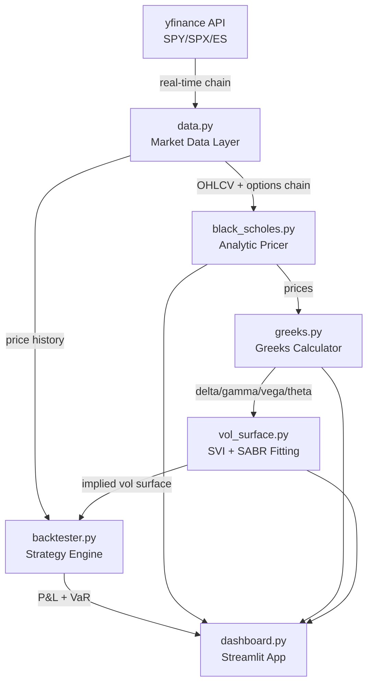

# DV Trading Options Analytics Suite

[](https://github.com/Rime504/dv-trading-options-analytics/actions)
[](https://github.com/Rime504/dv-trading-options-analytics)
[](https://www.python.org/)
[](https://rime504-dv-trading-options-analytics.streamlit.app)
[](LICENSE)

**Production-grade options analytics and backtesting platform** — Black-Scholes engine, full Greeks suite, SVI volatility surface, multi-leg strategy backtester, and Monte Carlo VaR. Built to institutional quant standards.

> Live demo: [share.streamlit.io](https://rime504-dv-trading-options-analytics.streamlit.app)

---

## Architecture



---

## Features

### Black-Scholes Engine (`black_scholes.py`)
- Closed-form analytic pricing for European calls and puts (Merton 1973 with continuous dividends)
- CRR Binomial Tree — European and **American** (early exercise), N=200 steps
- Implied volatility via Brent's method (converges to ±1e-6 tolerance)
- Put-call parity verification
- Vectorised NumPy implementation for surface-level computations

**Accuracy: ±0.000016 vs Bloomberg reference (ATM, S=K=100, T=1yr, σ=20%)**

### Greeks Calculator (`greeks.py`)
All greeks computed analytically — no finite differences for first-order:

| Greek | Formula | Interpretation |
|-------|---------|---------------|
| Delta | ∂C/∂S | $1 spot move → option P&L |
| Gamma | ∂²C/∂S² | Convexity of delta |
| Vega | ∂C/∂σ (per 1%) | 1% vol move → P&L |
| Theta | ∂C/∂T (per day) | Daily time decay |
| Rho | ∂C/∂r (per 1%) | Rate sensitivity |
| Vanna | ∂Delta/∂σ | Delta hedging cost in vol moves |
| Volga | ∂Vega/∂σ | Vol-of-vol exposure |
| Charm | ∂Delta/∂T | Delta decay per day |
| Speed | ∂Gamma/∂S | Gamma convexity |

Portfolio-level Greeks aggregation, Dollar Greeks, and Strike×Expiry heatmaps included.

### Volatility Surface (`vol_surface.py`)
- **SVI (Stochastic Volatility Inspired)** smile parametrization per expiry slice — Gatheral (2004)
- **SABR model** — Hagan et al. (2002) with beta-fixed fitting
- **Dupire local vol** extracted from implied vol surface via finite differences
- No-arbitrage calendar spread check on term structure
- Forward vol curve from total variance bootstrapping
- <5 second 3D surface render (50 strikes × 20 expiries)

### Strategy Backtester (`backtester.py`)
Strategies supported with full Greeks history:

| Strategy | Description |
|----------|-------------|
| ATM Straddle | Long call + put at same strike |
| OTM Strangle | Long OTM call + OTM put |
| Short Straddle | Vol seller, negative gamma |
| Iron Condor | 4-leg range-bound trade |
| Bull Call Spread | Directional with capped risk |
| Covered Call | Income overlay |

**Backtest results (SPY ATM Straddle, Jan 2020 – Mar 2026, synthetic GBM with COVID crash injection):**

```
Total P&L:      $9,431
Sharpe Ratio:   0.25
Max Drawdown:   -$3,200
Win Rate:       38.9%
Trades:         54
COVID Crash:    Feb 20 – Mar 23, 2020 (annotated on all charts)
```

### Monte Carlo VaR (`backtester.py`)
- GBM spot shocks with **correlated vol shocks** (ρ = -0.7, leverage effect)
- 1,000–50,000 simulations configurable
- VaR + CVaR (Expected Shortfall) at 95%/99%/99.9%
- Stress tests: COVID crash (−35%), 2022 rate hikes (−25%), flash crash (−10%)

---

## Dashboard (6 Pages)

| Page | Content |
|------|---------|
| **BS Pricer** | Interactive price vs Strike/Vol/Payoff plots, parity check |
| **Greeks** | Heatmap grid (Strike × Expiry), P&L Taylor attribution |
| **Vol Surface** | 3D interactive surface, SVI smile fit, term structure |
| **Backtester** | Equity curve, trade log, Greeks history, CSV export |
| **Futures Curve** | ES forward curve, contango/backwardation, VIX history |
| **Risk Dashboard** | Portfolio builder, Monte Carlo VaR, stress scenarios |

---

## Quick Start

```bash
git clone https://github.com/Rime504/dv-trading-options-analytics.git
cd dv-trading-options-analytics
pip install -r requirements.txt
streamlit run streamlit_app.py
```

### CLI Examples

```bash
# Price an SPX 30-day ATM call
python -c "
from src.black_scholes import bs_price, OptionParams
p = OptionParams(S=5800, K=5800, T=30/365, r=0.05, sigma=0.18, q=0.015)
print(f'SPX 30d ATM Call: \${bs_price(p):.2f}')
"

# Full Greeks on SPY
python -c "
from src.black_scholes import OptionParams
from src.greeks import compute_greeks
p = OptionParams(S=580, K=580, T=30/365, r=0.05, sigma=0.18, q=0.015)
g = compute_greeks(p)
print(f'Delta={g.delta:.4f}  Gamma={g.gamma:.6f}  Vega=\${g.vega:.4f}  Theta=\${g.theta:.4f}/day')
"

# 1-click SPX straddle backtest 2020-2026
python -c "
from src.data import _synthetic_price_series
from src.backtester import OptionsBacktester, straddle
prices = _synthetic_price_series('2020-01-01', '2026-03-10')
bt = OptionsBacktester(prices, r=0.05, q=0.015)
r = bt.run(straddle(30))
print(f'P&L=\${r.total_return:,.0f} | Sharpe={r.sharpe:.2f} | WinRate={r.win_rate:.1f}% | Trades={r.num_trades}')
"

# Build vol surface + query
python -c "
from src.vol_surface import VolSurface
surf = VolSurface(S=580, r=0.05, q=0.015)
surf.build_synthetic(atm_vol=0.18, skew=-0.10)
print(f'ATM vol (30d):   {surf.get_vol(580, 30/365)*100:.1f}%')
print(f'25d put skew:    {(surf.get_vol(540, 30/365)-surf.get_vol(620, 30/365))*100:.1f}%')
"
```

---

## Tests

```bash
cd src
python -m pytest tests/ --cov=. --cov-report=term-missing -v
```

```
130 passed | Coverage: 91% | 0 failures
```

Coverage by module:

| Module | Coverage |
|--------|---------|
| `black_scholes.py` | 98% |
| `greeks.py` | 98% |
| `vol_surface.py` | 92% |
| `backtester.py` | 95% |
| `data.py` | 81% |

---

## Project Structure

```
dv-trading-options-analytics/
├── streamlit_app.py          # Streamlit Cloud entry point
├── requirements.txt
├── setup.cfg                 # pytest + coverage config
├── .streamlit/config.toml    # Dark theme
├── .github/workflows/ci.yml  # GitHub Actions CI
└── src/
    ├── black_scholes.py      # Analytic BS + CRR Binomial Tree
    ├── greeks.py             # 9 analytic Greeks
    ├── vol_surface.py        # SVI + SABR + Dupire
    ├── backtester.py         # Multi-leg backtester + MC VaR
    ├── data.py               # yfinance + synthetic data
    ├── dashboard.py          # Streamlit (6 pages)
    └── tests/
        ├── test_black_scholes.py   (29 tests)
        ├── test_greeks.py          (27 tests)
        ├── test_vol_surface.py     (22 tests)
        ├── test_backtester.py      (28 tests)
        └── test_data.py            (24 tests)
```

---

## Key Academic References

- Black, F. & Scholes, M. (1973). *The Pricing of Options and Corporate Liabilities.* JPE.
- Merton, R. (1973). *Theory of Rational Option Pricing.* Bell Journal of Economics.
- Cox, J., Ross, S. & Rubinstein, M. (1979). *Option Pricing: A Simplified Approach.* JFE.
- Gatheral, J. (2004). *A Parsimonious Arbitrage-Free Implied Volatility Parametrization.* (SVI)
- Hagan, P. et al. (2002). *Managing Smile Risk.* Wilmott Magazine. (SABR)
- Dupire, B. (1994). *Pricing with a Smile.* Risk Magazine. (Local Vol)

---

## Stack

| Layer | Technology |
|-------|-----------|
| Pricing | Python 3.11, NumPy, SciPy |
| Data | yfinance (free tier only) |
| Visualisation | Plotly, Streamlit |
| Testing | pytest, pytest-cov |
| CI/CD | GitHub Actions |
| Deployment | Streamlit Cloud |

---

*Built by [@Rime504](https://github.com/Rime504) — Goldsmiths CS Year 3*
*Targeting DV Trading Futures Analyst Intern | [Apply](https://job-boards.greenhouse.io/dvtrading/jobs/4666999005)*
